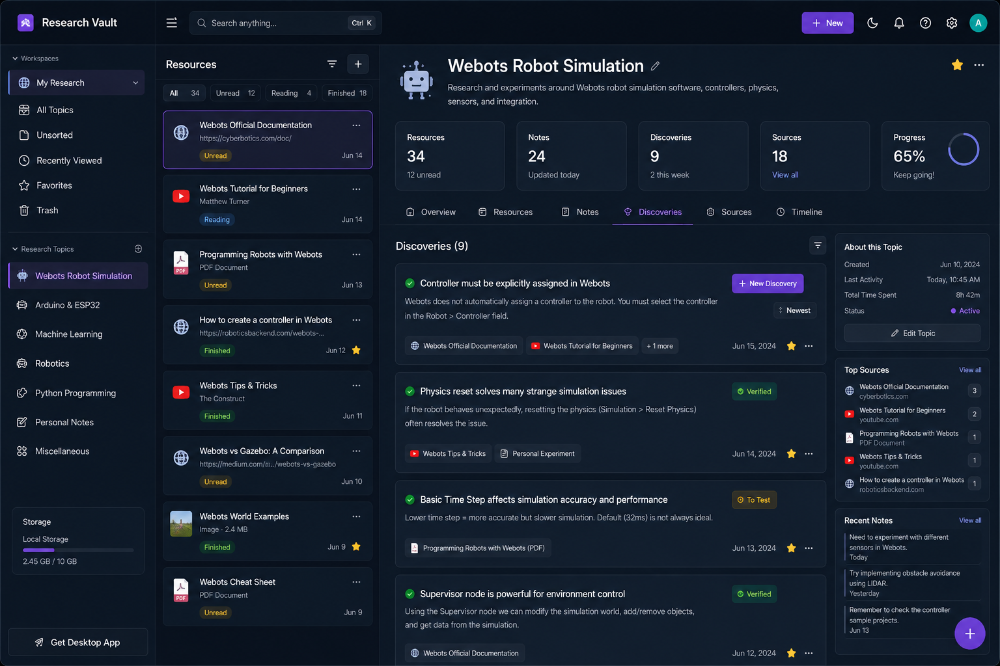

# Research Knowledge Vault - Product Flow (MVP)

## Vision

Create an offline-first personal research system that makes it effortless to capture discoveries, research resources, notes, and knowledge while preserving the original sources.

The system should feel as easy as sending a message while remaining powerful enough to build a lifelong knowledge base.

---

# Core Philosophy

Most knowledge apps optimize for organization.

This product optimizes for capture.

The user should be able to save a discovery in seconds.

Organization happens automatically or later.

---

# Main Objects

The system contains four primary objects.

## 1. Research Topic

Examples:

* Arduino
* Webots
* Robotics
* Machine Learning
* Bible Study

A Research Topic acts as a container.

---

## 2. Resource

Anything consumed or planned for consumption.

Examples:

* Website
* YouTube Video
* PDF
* Book
* Image
* Research Paper
* Personal Conversation

Resources can be marked:

* Unread
* Reading
* Finished
* Valuable
* Archived

---

## 3. Notes

Personal thoughts.

Examples:

* Questions
* Ideas
* Summaries
* Opinions
* Observations

Notes are informal and editable.

---

## 4. Discoveries

Things learned.

Examples:

* Holding BOOT fixes ESP32 upload issues.
* Webots controllers must be assigned manually.
* This tutorial missed an important setup step.

Discoveries are the distilled output of research.

---

# User Flow

## Flow A - Quick Discovery

User opens app.

Presses:

* New Discovery

Types:

"BOOT button fixes ESP32 timeout error."

Presses Save.

Discovery is stored.

No forms required.

Estimated time:

5 seconds.

---

## Flow B - Save Resource

User finds useful content.

Presses:

* Add Resource

Pastes:

Website URL

or

YouTube URL

or

PDF

Resource is saved.

Status automatically becomes:

Unread

No notes required.

Estimated time:

3 seconds.

---

## Flow C - Research Session

User opens:

Webots Research

Tabs available:

Overview
Resources
Notes
Discoveries
Sources
Timeline

User reads resources.

Updates status:

Unread → Reading → Finished

Adds notes while reading.

Creates discoveries from notes.

---

## Flow D - Discovery Creation From Notes

User note:

"The tutorial forgot controller assignment."

User highlights note.

Presses:

Convert To Discovery

Discovery created:

"Controller assignment required before code execution."

Linked to source automatically.

---

# Research Topic Layout

Topic: Webots

Tabs:

1. Overview
2. Resources
3. Notes
4. Discoveries
5. Sources
6. Timeline

---

# Overview Tab

Shows:

* Topic name
* Resource count
* Discovery count
* Notes count
* Last activity
* Progress

Example:

Resources: 34

Unread: 12

Finished: 18

Discoveries: 9

Notes: 24

---

# Resources Tab

Displays all consumed or saved materials.

Filters:

* All
* Unread
* Reading
* Finished
* Valuable

Resource Card:

Title

Type

Status

Date Added

Optional Source Information

---

# Notes Tab

Free-form thinking area.

Supports:

* Text
* Images
* Links
* Code snippets
* Checklists

Notes remain private by default.

---

# Discoveries Tab

Knowledge extracted from research.

Each discovery contains:

Title

Discovery Statement

Related Notes

Related Resources

Personal Verification Status

Visibility

Private/Public

---

# Sources Tab

Displays original source information.

Examples:

Website

Author

Publication Date

URL

Book

Author

Pages

Publisher

Video

Channel

Video URL

Sources are encouraged but not mandatory.

---

# Timeline Tab

Chronological learning history.

Example:

June 14

Added 12 resources

June 15

Created discovery

June 16

Added notes

June 18

Marked resource valuable

---

# Search

Global search searches:

Topics

Resources

Notes

Discoveries

Sources

Attachments

Search Result Example:

Query:

ESP32

Results:

Resources (12)

Notes (18)

Discoveries (7)

Sources (3)

---

# Privacy Model

Default:

Private

All content remains local.

User may manually enable:

Public Sharing

Only selected discoveries are published.

Notes remain private unless explicitly shared.

---

# MVP Features

Required:

Offline storage

SQLite database

Research Topics

Resources

Notes

Discoveries

Source tracking

Search

Attachments

Private by default

Export/Import

---

# Future Versions

Version 2

Knowledge graph

Mind maps

Browser extension

Mobile sharing

AI-assisted categorization

AI source extraction

AI summaries

Community discovery network

Version 3

Collaborative research spaces

Public discovery marketplace

Cross-user knowledge linking

Citation generation

Academic research mode
